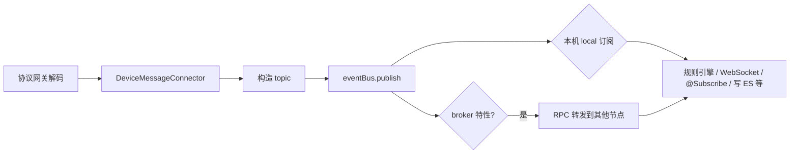

# EventBus 原理与现网用法

> **归档来源**：会话 `1bd66f60-ac28-45d4-bf4d-7acf08161b3c`（2026-09-03）  
> **证据仓**：`D:\gerrit\iot-server`（只读；类名/路径仅作索引）  
> **用途**：把「概念懂了但讲不清怎么玩」落成可白板、可追问的 L2～L3 笔记  
> **上位文档**：[`IoT全链路白板.md`](IoT全链路白板.md) §6/§8 · [`面试连环深追脚本.md`](../05-Interview-Prep/面试连环深追脚本.md) §4

---

## L0 · 30 秒口径

**EventBus = 带 Topic 通配符的响应式进程内消息总线 + 可选集群 RPC 转发。**

设备报文经协议网关解码 → `DeviceMessageConnector` 算 topic → `eventBus.publish` → Topic 树匹配本机订阅者；带 `broker` 特性的订阅还会经 **Scalecube RPC** 转到其它节点。规则引擎、WebSocket 推前端、写 ES 等都在这条总线上 **订阅**，不是设备上报先进 Pulsar。

---

## 1. 它是什么（别和 Spring Event 混）

| 项 | 内容 |
|----|------|
| 接口 | `org.jetlinks.core.event.EventBus` |
| 现网实现 | `ClusterEventBus`（`ClusterConfiguration` 注册 Bean） |
| 数据结构 | `Topic.createRoot()` 一棵 **Topic 树**（类似 MQTT 通配符） |
| 编程模型 | **Reactor**（`Mono` / `Flux`），不是阻塞队列 |
| **不是** | Spring `ApplicationEventPublisher` / `@EventListener` |

类名带 `EventBus` 的 DTO（如 `SaveDataflowMessageEventBusDTO`）走 **Spring 进程内事件**，与 JetLinks EventBus **两套机制**，面试被追问时要主动切开。

---

## 2. 整体数据流（设备上报）



**发布端锚点**：`DeviceMessageConnector.onMessage` → `convertToDeviceMessage` → `getTopic` → `eventBus.publish(topic, msg)`。

**Topic 命名**（脱敏模式）：

```text
/device/{productId}/{deviceId}/message/property/report
/device/{productId}/{deviceId}/online
/device/{productId}/{deviceId}/offline
```

一条消息可能 **fan-out 到多个 topic**（租户/组织/创建人绑定），下游用消息 header 里的 `uid` 去重。

---

## 3. 订阅的三种玩法

### A. 直接 API

```java
eventBus.subscribe(
    Subscription.of("my-id",
        new String[]{"/device/*/*/message/**"},
        Subscription.Feature.local,
        Subscription.Feature.broker)
);
```

WebSocket 前端订阅设备消息：`DeviceMessageSubscriptionProvider` 走此模式（带资产权限过滤）。

### B. `@Subscribe` 注解（业务代码最常见）

启动时 `SpringMessageBroker` 扫描带 `@Subscribe` 的方法，自动注册到 EventBus；方法参数从 `TopicPayload` 自动解码。

```java
@Subscribe(
    topics = "/mq/*/*/*/TRANSPARENT/DEVICE_MESSAGE_SYNC_STATUS_CALLBACK",
    features = {Subscription.Feature.broker, Subscription.Feature.local})
public Mono<Void> callbackSyncMessage211(PushTransparentMqMessage message) { ... }
```

### C. WebSocket 外部订阅

前端经 gateway 的 `SubscriptionProvider` 间接订阅 EventBus。

---

## 4. `publish` 内部原理（`doPublish`）

| 机制 | 作用 |
|------|------|
| Topic 树 + 通配符 | `/device/*/*/online` 匹配具体设备 topic |
| handler 去重 | 同一回调不会被调两次 |
| **priority** 排序 | 高优先级订阅者先收到 |
| **shared** | 多实例负载均衡，只选一个消费 |
| 返回 `Mono<Long>` | 值为实际派发的订阅者数量；默认 **等所有 handler 的 Mono 完成**（非 fire-and-forget） |

**压测口径**：GIIC 曾讨论 EventBus **FAF**（不等 handler），但 **device-manager 政策不能改**，最终没上；压测卸压在网关/协议侧。见 [`GIIC压测-规划方法论与交接Playbook.md`](GIIC压测-规划方法论与交接Playbook.md)。

---

## 5. 集群原理（多 Pod / 多节点）

通过 **Scalecube RPC（RSocket）** 同步订阅表并转发消息：

| `Subscription.Feature` | 含义 |
|------------------------|------|
| `local` | 只收 **本机** publish 的 |
| `broker` | 也收 **其他节点** publish 的（集群广播） |
| `shared` | 集群内相同 subscriberId **只选一个** 实例消费 |

```text
节点 A 订阅 /device/** 且带 broker
  → 通知集群「我在 broker 这条 topic 上」

节点 B publish /device/p1/d1/online
  → 本机 local 订阅者直接收到
  → broker 订阅者：序列化 ByteBuf，RPC 到节点 A 再本地 dispatch
```

节点下线时 `handleServiceEvent(removed)` 清理该节点的 cluster 订阅，避免泄漏（与 OOM 案例里 `EventBusStorageManager` 相关，见 [`cases/kh-iot-server-operatorCache-OOM-2026-08-17/`](cases/kh-iot-server-operatorCache-OOM-2026-08-17/)）。

---

## 6. EventBus vs Spring Event vs Pulsar（白板用）

| | JetLinks EventBus | Spring ApplicationEvent | Pulsar |
|--|-------------------|-------------------------|--------|
| 范围 | 可跨集群节点（RPC） | 单 JVM | 跨服务、可持久化 |
| 路由 | Topic 通配符 | 按 Java 类型 | Topic + 订阅 |
| 模型 | Reactor Mono/Flux | 同步/异步 listener | 持久化队列 |
| 现网主用途 | **设备实时上报第一跳** | 落 ES、内部业务解耦 | **级联**、长积压、跨服务异步 |
| 代价 | 进程内背压/隔离要自己治 | 不能跨 Pod | 序列化 + 网络 + 消费延迟 |

**面试红线**：不说「设备上报先进 Pulsar」；Pulsar 只讲已证边界（级联等）。完整追问见 [`面试连环深追脚本.md`](../05-Interview-Prep/面试连环深追脚本.md) §4。

---

## 7. L3 · 白板 1 张（09-19 验收用）

```text
[设备] --MQTT/CoAP--> [协议网关 Pod]
                          |
                          v
              DeviceMessageConnector
                          |
                    eventBus.publish
                    /      |      \
            规则引擎   WebSocket   写 ES/MySQL
                    \      |      /
                     broker RPC（其它 Pod 的订阅者）

[Pulsar] <--- 级联 / 跨服务 ---> 不在设备上报第一跳
```

---

## 8. 常见追问（简答）

| 追问 | 答法要点 |
|------|----------|
| 为什么上报不先落 Pulsar？ | 实时链路要短路径、低延迟；解码后进程内分发够快；Pulsar 留给要持久化/削峰/跨服务的线 |
| handler 慢了怎么办？ | `publish` 会等 handler Mono；慢 handler 拖整条链——压测时靠网关拆队列、批写，不是改 EventBus FAF |
| 和 MQTT broker 什么关系？ | 我们 **内嵌 MqttServer**，解码后进 EventBus；不是外置 EMQX 再桥接（口径见白板 §8） |
| 多副本怎么推前端？ | WebSocket 订阅带 broker；或 shared 做消费均衡 |
| 订阅泄漏 / OOM？ | 节点下线要清 cluster 订阅；operatorCache 是另一类堆问题，别混讲 |

---

## 9. 源码索引（只读核对用）

| 类 | 路径（iot-server） |
|----|-------------------|
| `ClusterEventBus` | `khlinks-components/common-component/.../cluster/ClusterEventBus.java` |
| `ClusterConfiguration` | `khlinks-components/configure-component/.../cluster/ClusterConfiguration.java` |
| `DeviceMessageConnector` | `khlinks-manager/kh-device/device-manager/.../DeviceMessageConnector.java` |
| `SpringMessageBroker` | `khlinks-components/gateway-component/.../spring/SpringMessageBroker.java` |
| `DeviceMessageSubscriptionProvider` | `khlinks-manager/kh-device/device-manager/.../DeviceMessageSubscriptionProvider.java` |
| `TopicUtils` | `khlinks-components/common-component/.../utils/TopicUtils.java` |

---

## 10. 关联文档

| 文档 | 关系 |
|------|------|
| [`IoT业务流程梳理.md`](IoT业务流程梳理.md) §4 | 阶段 3 消息总线（topic 表） |
| [`IoT全链路白板.md`](IoT全链路白板.md) §6/§8 | 链路红线、GIIC 汇合点 |
| [`面试连环深追脚本.md`](../05-Interview-Prep/面试连环深追脚本.md) §4 | EventBus vs Pulsar 边界 + 5 连追 |
| [`cases/kh-iot-server-operatorCache-OOM-2026-08-17/`](cases/kh-iot-server-operatorCache-OOM-2026-08-17/) | 订阅表/堆问题（别和 FAF 混） |

---

## 还不懂 / 下一步

- [ ] 遮稿画 §7 白板 1 遍 + 录音（冲刺日历 09-19）
- [ ] 自选一条链深追：属性上报 → 规则引擎 → WebSocket 推前端（类名现场对 gerrit）
- [ ] GIIC 压测卡在 `publish` 的排查证据补进 [`GIIC-15万压测参与复盘.md`](GIIC-15万压测参与复盘.md)（若有日志）
