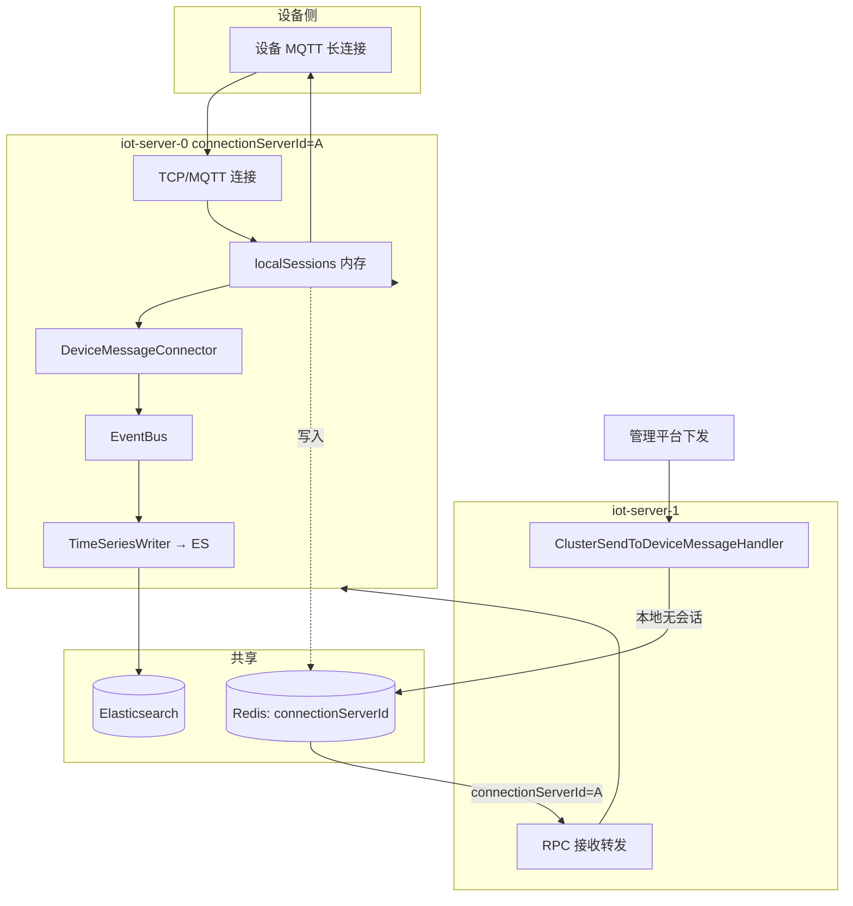

# IoT 业务流程梳理（现网 · 代码级 · 脱敏）

> 面试简版：[`IoT全链路白板.md`](IoT全链路白板.md)  
> 来源：2026-05 现网梳理（iot-server / JetLinks 系架构）  
> **代码对照（只读）**：`D:\gerrit\iot-server` — 禁止修改，见 [`docs/现网仓库只读约束.md`](../docs/现网仓库只读约束.md)

---

## 1. 物理接入

```text
设备 mqtt:1883
  → MetalLB VIP
  → nginx(iot-web) TCP 透传
  → iot-server:1883
```

---

## 2. 阶段 1：MQTT 连接与认证

```text
MqttServer#handleConnection()
  → MqttConnection#getClientId() 作为设备 ID
  → 设备注册中心取 DeviceOperator
  → DeviceOperator#getProtocol()
  → ProtocolSupport#authenticate(AuthenticationRequest, DeviceOperator)
  → 认证通过：应答 MQTT，DeviceSessionManager#compute 注册会话
```

| 依赖 | 作用 |
|------|------|
| **MySQL** | 设备元数据：产品、密钥、协议包 |
| **Redis** | 设备元数据、集群节点信息 | 认证阶段；会话路由见 §7.1 |

监听消息：`MqttConnection#handleMessage()` → `ProtocolSupport#getMessageCodec` → `DeviceMessageCodec#decode`

---

## 3. 阶段 2：上行消息解码

```text
设备 PUBLISH
  → VertxMqttConnection（Netty / Vert.x）
  → MqttServerDeviceGateway#decodeAndHandleMessage()
       按产品协议解码
  → （超级设备）preHandleAcceptedMqttConnection → AbilityDistributionUtil
  → 统一模型 DeviceMessage
```

---

## 4. 阶段 3：消息总线（业务中枢）

`DecodedClientMessageHandler`：网关解码后的设备消息 → **EventBus**；会话注册/注销 → 上下线消息也进 EventBus。

**到此才算进入业务层**：规则引擎、数据流转、级联、前端推送等均 **订阅 EventBus**。

### EventBus topic 示例

| Topic | 含义 |
|-------|------|
| `/device/{productId}/{deviceId}/reportProperty` | 属性上报 |
| `/device/.../online` | 上线 |
| `/device/.../offline` | 下线 |
| `/device/.../update_line` | 超级设备节点拓扑变化 |

---

## 5. 阶段 4：持久化三分工

| 存储 | 存什么 | 代码/机制 |
|------|--------|-----------|
| **MySQL** | 设备实例、产品、网关配置、最新属性、在线状态 | `DeviceMessageBusinessHandler` 批量 `syncState`；`DatabaseDeviceLatestDataService` 写 latest 表；在线状态 **缓冲批写** |
| **Elasticsearch** | 时序：属性历史、事件、日志 | `TimeSeriesMessageWriterConnector` 订阅 `/device/**` → `saveDeviceMessage` → ES |
| **Redis** | **路由索引**（`connectionServerId`/`sessionId`）、缓存、限流、鉴权、统计 | `ConfigStorageManager`、`RedisClusterManager`；**不存 TCP 本体** |

---

## 6. 阶段 5：实时推送前端

```text
EventBus → WebSocket（/api/messaging）→ 浏览器
```

超级设备：`update_line` → 空间管理页面刷新节点状态。

---

## 7. 下行链路（云 → 设备）

```text
API / 规则引擎发指令
  → ClusterSendToDeviceMessageHandler / MessageHandler
  → DeviceSessionManager：先查本 Pod localSessions
  → 本地无会话：读 Redis 中 connectionServerId
  → 集群 RPC 转到持有 TCP 的 Pod
  → MqttConnectionSession → Protocol.encode → MQTT PUBLISH
  → 同一 TCP 连接回设备
```

### 7.1 会话三层（连接治理核心 · 面试常问）

**MQTT 长连接本体只在 JVM 内存；Redis/H2 都是索引或元数据，不能替代 TCP。**

```text
┌─────────────────────────────────────────────────────────────┐
│ 第1层：JVM 内存（真正干活）                                    │
│   localSessions: Map<deviceId, MqttConnectionSession>       │
│   └─ MqttConnectionSession.connection → VertxMqttConnection │
│      └─ 底层 TCP Socket（MQTT 长连接本体）                     │
└─────────────────────────────────────────────────────────────┘
         │ 会话建立/变更时写入
         ▼
┌─────────────────────────────────────────────────────────────┐
│ 第2层：Redis（集群可见的「路由索引」）                         │
│   device.online(serverId, clientAddress) 写入设备配置：        │
│   - connectionServerId  → 如 "KaihongOS Meta:8844"          │
│   - sessionId           → 会话标识                           │
│   存在 ConfigStorageManager（Redis）                         │
└─────────────────────────────────────────────────────────────┘
         │ 可选持久化（进程重启恢复元数据，TCP 不能恢复）
         ▼
┌─────────────────────────────────────────────────────────────┐
│ 第3层：本地 H2 文件（PersistenceDeviceSessionManager）        │
│   ./data/sessions/{clusterId}                               │
│   存 PersistentSessionEntity（deviceId、serverId、序列化信息） │
│   重启后可恢复「会话元数据」，但 MQTT TCP 仍需设备重连         │
└─────────────────────────────────────────────────────────────┘
```

| 层 | 作用 | 重启/扩缩容 |
|----|------|-------------|
| **JVM localSessions** | 持有 **真实 MQTT TCP** | Pod 重启 → 连接断开，设备需重连 |
| **Redis** | 全集群查 **设备在哪个 Pod**（`connectionServerId`） | 下行路由、RPC 寻址 |
| **H2 文件** | 会话 **元数据** 落盘 | 可恢复索引信息，**不恢复 Socket** |

### 7.2 多副本下行（Pod-A 持连接 · Pod-B 收 API）



**上行**：设备连到哪个 Pod，会话就在该 Pod 的 `localSessions`，同时 **Redis 写入 connectionServerId**。  
**下行**：API 打到 Pod-B → 本地无会话 → **Redis 查 connectionServerId=A** → **RPC 到 Pod-A** → 从内存 Session 发 PUBLISH。

---

## 8. 总览 ASCII（与白板一致）

```text
┌──────────┐     TCP:1883      ┌─────────┐    stream    ┌──────────────────────────────────────┐
│  设备端   │ ───────────────► │ MetalLB │ ──────────► │ iot-web(nginx) → iot-server Pod      │
└──────────┘                   │   VIP   │               │                                      │
                               └─────────┘               │  MqttServerDeviceGateway             │
                                                         │    → Protocol 解码                   │
                                                         │    → DeviceMessageConnector          │
                                                         │         → EventBus                   │
                                                         │           ├─ TimeSeriesWriter → ES   │
                                                         │           ├─ LatestDataService → MySQL │
                                                         │           ├─ StateSync → MySQL       │
                                                         │           ├─ 规则/数据流/级联       │
                                                         │           └─ WebSocket → 前端        │
                                                         └──────────────────────────────────────┘
                                                                    │         │         │
                                                                    ▼         ▼         ▼
                                                                 MySQL     Redis      ES
```

---

## 9. 待补（W4 模块故事 / 清单）

- [ ] 我改过的具体类/配置/链路（脱敏）— 已知方向：**iot-server**、**级联**、压测 **Pulsar 调优**
- [ ] Pulsar 与设备主链路：**设备 PUBLISH 不经 Pulsar**；**级联**等场景用 Pulsar（压测协助调优）
- [ ] Nacos / MinIO / 达梦 在本链路中的挂载点（若在其它服务）
