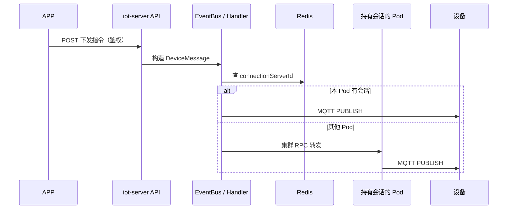

# 开放 API 与设备下发序列图

> JD-14 §2.4 · 深度目标 **L1→L2**

---

## L0 · 30 秒定义

**开放 API**：给 APP/第三方调用的 HTTP 接口，管鉴权、限流、版本。**BFF**：为前端（如 Flutter）聚合多个后端调用，做协议与字段适配。设备下发：API → 平台服务 → 找到设备所在网关 Pod → MQTT/CoAP PUBLISH。

---

## L1 · 我们平台有没有

- 设备控制/属性读写：iot-server `device-manager` 层 Controller（**待你只读填 1 个类名**）
- 鉴权：平台 Token / 设备侧密钥（与 GIIC Login 不同层）
- BFF：无独立 BFF 服务名；逻辑在 Web/API 层

---

## L2 · 序列图（模板 · 待填类名）

**验收**：能指着图讲 2 分钟；说出「慢在哪查 Redis/RPC，不是先调 JVM」。

---

## L3 · API 版本化

- URL：`/api/v1/` vs `/api/v2/`
- Header：`Accept-Version`
- 兼容：旧版保留 1～2 个 minor

---

## 还不懂 / 下一步

- [ ] 在 `D:\gerrit\iot-server` 只读搜 1 个下发接口 Controller，把类名填进上图
- [ ] 录音 2 分钟「从 APP 点到设备收到」
