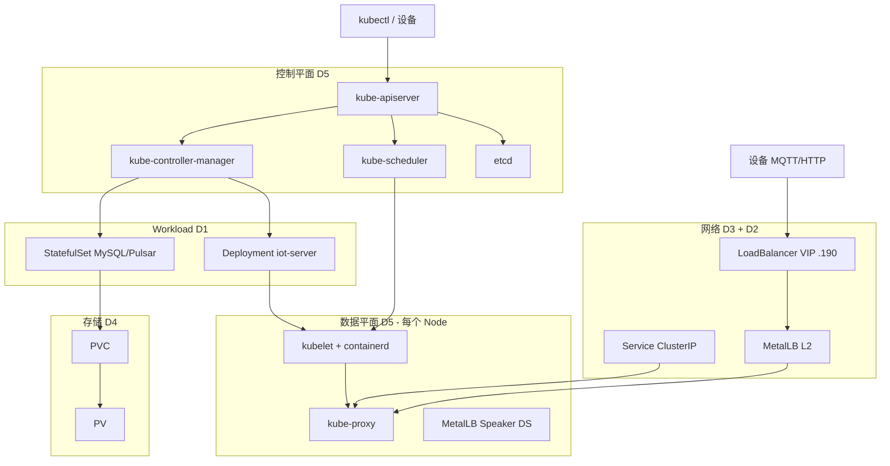

# 每日复习与串联指南（怎么用这套仓库）

> **学习**用 `W1_每日学习手册.md`（动手填表）  
> **复习**用本文（通读 + 口述 + 偶看题）  
> 你有空就读 5～15 分钟，不必每天学新内容。

---

## 一、你只需要记住 3 个入口

| 我想… | 打开 |
|--------|------|
| **5 分钟：别全忘** | 本文 **§三 每日 7 问**（盖住答案口述） |
| **15 分钟：串一遍** | 本文 **§二 一条线串讲** + 扫一眼 **§四 总图** |
| **30 分钟：深一点** | 本文 **§五 周轮动** 当天主题 → 对应 `notes/D?` + 抽 5 道面试题 |
| **忘了某个点** | 本文 **§六 查哪里** |
| **还在做 W1 作业** | `01-K8s-Troubleshooting/W1_每日学习手册.md` |

---

## 二、一条线串讲（背这一条就够面试开场）

**用你们现网讲 90 秒**（按顺序说，卡住的地方回笔记）：

```text
1. 【底层 D5】用户 kubectl 改 YAML → apiserver 是唯一入口 → 状态进 etcd
              → scheduler 把 Pod 绑到某个 node（比如 node6）
              → 该节点 kubelet 通过 containerd 起容器

2. 【Workload D1】业务多是 Deployment（iot-server）或 StatefulSet（MySQL/Pulsar）
              → Deploy 管 ReplicaSet 再管 Pod；STS 有固定名字、有序、每 Pod 一块 PVC

3. 【存储 D4】STS 用 volumeClaimTemplates 申请 PVC → 绑 PV
              → StorageClass 可动态建盘；生产库常用 Retain 防误删

4. 【网络 D3】集群内用 Service ClusterIP + kube-proxy 转发到 Pod
              → 对外 iot-web 是 LoadBalancer，裸机由 MetalLB 分 VIP 192.168.27.190
              → MetalLB L2 在 node6 上 ARP 宣告；设备连 VIP:80 和 :1883（MQTT）
              → MQTT 不走 HTTP Ingress，所以用 LB 不用 Ingress

5. 【排错顺序】Pod 起不来：scheduler？kubelet 镜像/探针？
              → 能起但访问不通：Endpoints 空？kube-proxy？还是 VIP/MetalLB？
              → 库慢：PVC/PV、STS、中间件本身
```

**自检**：能否不看稿说满 **60 秒**？不能则明天再读一遍 §二。

---

## 三、每日 7 问（有空就做，≈5 分钟）

> 盖住 [`interview/answers/`](../01-K8s-Troubleshooting/interview/answers/) 对应文件，**口述**答案。  
> 不会的在题清单「掌握」列保持 `[ ]`，别硬背。

| 星期 | 7 问（任答 4 个也算完成） |
|------|---------------------------|
| **一** | Deploy 和 STS 区别？ \| STS 为何要 Headless？ \| kubelet 和 kube-proxy 各管啥？ \| apiserver 挂了存量 Pod 怎样？ |
| **二** | Service 谁转发流量？ \| ClusterIP 和 VIP 区别？ \| MetalLB L2 谁宣告 VIP？ \| iot-web 为何用 1883+LB？ |
| **三** | PV/PVC/SC 各啥角色？ \| RWO 和 RWX？ \| 动态供给流程？ \| Retain 和 Delete？ |
| **四** | 创建 Pod 经过哪些组件？ \| scheduler 预选/优选？ \| containerd 和 Docker？ \| 控制平面 vs 数据平面？ |
| **五** | 串讲 §二 整条（60 秒） | |
| **六** | 从题清单每类 **抽 3 题** 快问（Workload/网络/存储/底层 各 1） | |
| **日** | 重读 [`notes/D2_MetalLB.md`](../01-K8s-Troubleshooting/notes/D2_MetalLB.md) §8 现网三行数字 | |

**打勾**：在 [`复习打卡.md`](../01-K8s-Troubleshooting/复习打卡.md) 记日期即可。

---

## 四、总图（通读时对着看）



---

## 五、周轮动（每次 15～30 分钟只攻一块）

| 周几 | 通读笔记 | 抽题文件 | 回忆重点 |
|------|----------|----------|----------|
| 一 | [`D1_Workload.md`](../01-K8s-Troubleshooting/notes/D1_Workload.md) | `Workload_面试题清单` §一 | Deploy/STS/DS + 现网谁是谁 |
| 二 | [`D3_网络路由.md`](../01-K8s-Troubleshooting/notes/D3_网络路由.md) + [`D2_MetalLB.md`](../01-K8s-Troubleshooting/notes/D2_MetalLB.md) §8 | `网络路由` + `MetalLB` 各 5 题 | VIP 路径、1883 |
| 三 | [`D4_存储.md`](../01-K8s-Troubleshooting/notes/D4_存储.md) | `存储_面试题清单` §一～三 | PVC、STS、Retain |
| 四 | [`D5_底层组件.md`](../01-K8s-Troubleshooting/notes/D5_底层组件.md) | `底层组件` §一、三 | 创建 Pod 链路 |
| 五 | **只读**本文 §二，录音 60 秒 | — | 串讲 |
| 六 | 翻 [`复习打卡.md`](../01-K8s-Troubleshooting/复习打卡.md) 弱项笔记 | 弱项题清单 10 题 | 补洞 |
| 日 | 休息或只做 §三 当日 7 问 | — | — |

**原则**：同一天 **不要** 通读 5 份笔记；**一块 + 几道题** 比泛泛全读更有效。

---

## 六、忘了查哪里（决策树）

```text
问的是…                          → 打开
─────────────────────────────────────────
Pod / Deploy / STS / DaemonSet     → notes/D1_Workload.md
Service / Ingress / CNI / NP       → notes/D3_网络路由.md
VIP / MetalLB / node6 / 1883       → notes/D2_MetalLB.md
PV / PVC / StorageClass            → notes/D4_存储.md
apiserver / etcd / scheduler / kubelet → notes/D5_底层组件.md
想刷题                             → interview/README.md 选主题
想串整体                           → 本文 §二
现网服务列表                       → 生产服务清单.md + 映射表.md
```

---

## 七、学习 vs 复习（别混）

| | 学习（第一次） | 复习（你现在） |
|---|----------------|----------------|
| 目标 | 填表、命令、证据 | 不忘、能串、能答 |
| 文档 | `W1_每日学习手册` D1～D7 | **本文** + `notes/D1～D5` |
| 频率 | 每天 1.5h 推进 | 有空 5～15min |
| 标准 | §9 导师校验 | §三 7 问能答 4 个 |

**W1 作业没交完**：先补手册 §8，复习不替代作业。

---

## 八、最小维持方案（再忙也能做）

每周至少：

- [ ] **2 次** §三 每日 7 问（不同星期行）
- [ ] **1 次** §二 60 秒串讲（对自己或录音）
- [ ] **1 次** §五 周轮动里任选 1 份笔记通读

坚持 3 周，比一次通读 5 份笔记更有效。

---

## 九、文件索引（所有笔记与题）

| 类型 | 目录 |
|------|------|
| 笔记 D1～D5 | [`01-K8s-Troubleshooting/notes/`](../01-K8s-Troubleshooting/notes/README.md) |
| 面试题 + 答案 | [`01-K8s-Troubleshooting/interview/`](../01-K8s-Troubleshooting/interview/README.md) |
| 现网清单 | `01-K8s-Troubleshooting/生产服务清单.md` |
| 打卡 | `01-K8s-Troubleshooting/复习打卡.md` |
