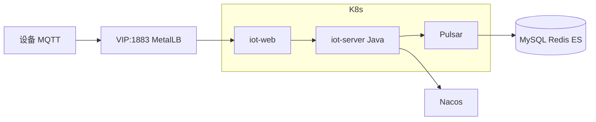

# 每日复习与串联指南（v3 · IoT 开场优先）

> **主路径（今天学什么 / 明天学什么 / 面试怎么讲）** →  
> **[`05-Interview-Prep/学习路径与面试串讲.md`](../05-Interview-Prep/学习路径与面试串讲.md)**  
>
> 本文 = **复习**用（5～15min 不断档）；**学习**用当周手册（W1 全景信心，非模块故事）。

---

## 一、3 个入口

| 我想… | 打开 |
|--------|------|
| **今天/明天学什么、面试怎么串** | **[`学习路径与面试串讲.md`](../05-Interview-Prep/学习路径与面试串讲.md)** |
| **5 分钟复习** | 本文 **§三 每日 7 问** |
| **90 秒 IoT 开场**（W2 后） | 本文 **§二** |
| **60 秒 K8s 防守**（W4 后，勿当开场） | 本文 **§K8s** |
| **W1 做作业** | [`W1_全景信心手册.md`](../02-EMQX-IoT-Tuning/W1_全景信心手册.md) |
| **W4 K8s 作业** | [`01/.../W1_每日学习手册.md`](../01-K8s-Troubleshooting/W1_每日学习手册.md) |
| **W6 压测参与** | [`W1_压测复盘手册.md`](../02-EMQX-IoT-Tuning/W1_压测复盘手册.md) |

---

## 二、90 秒 IoT 全链路（W2 后主开场 · 背这一条）

**按现网讲**（卡壳回 `IoT全链路白板.md` 或 mqtt A2）：

```text
1. 【设备】MQTT 连 VIP:1883（MetalLB → iot-web 接入层）

2. 【Java】iot-server 处理鉴权/业务/转发 — 我负责 ______ 模块（W1 故事）

3. 【消息】上报进 Pulsar Topic → 消费者写 MySQL / Redis / ES

4. 【治理】连接满/积压时：限流、扩容、消费 lag — 见连接治理 / 稳定性 SOP

5. 【规模】平台 40 万级；压测我参与 ______ 段优化（W6 填，非 owner）

6. 【之前】电商/社区 ______（故事 #1 一句）
```

**自检**：W2 后能否 **90 秒** 不脱稿？每周五录音对照 [`学习路径`](../05-Interview-Prep/学习路径与面试串讲.md) §八。

---

## §K8s 60 秒串讲（W4 后 · 仅追问时用）

> 旧版把 K8s 当开场 — **v3 禁止**。仅技术面问部署/排错时用。

```text
Deployment(iot-server) / StatefulSet(MySQL,Pulsar)
→ Service → LoadBalancer(VIP) → MetalLB L2 → 设备 :1883
→ Pod 起不来：scheduler / kubelet / 探针
→ 通不通：Endpoints / VIP / MetalLB
```

详图见下文 §四 mermaid（W4 后再看）。

---

## 三、每日 7 问（v3 · 按周次切换）

### Phase A（W1～W3 · IoT 为主）

| 星期 | 7 问（答 4 个即算完成） |
|------|-------------------------|
| **一** | 设备→1883→iot-server→Pulsar 各干什么？ \| 物模型是什么？ \| 影子解决什么？ \| W4 再答「你改了什么」 |
| **二** | MQTT Connect 关键字段？ \| QoS0/1 区别？ \| Clean Session 影响离线？ \| 现网 topic 分层？ |
| **三** | 连接风暴先看什么？ \| Pulsar backlog 怎么看？ \| 稳定性 SOP 第一步？ \| 故事 #3 现象？ |
| **四** | 90 秒 §二 全链路 | |
| **五** | 5min 故事 #2 或 #3 口述 | |
| **六** | JD 雷达抽 2 词各 30 秒 | |
| **日** | 读 [`学习路径`](../05-Interview-Prep/学习路径与面试串讲.md) 确认 **明天 D?** | |

### Phase B（W4 后 · 加 K8s 7 问）

| 星期 | 追加/替换 |
|------|-----------|
| **一** | Deploy vs STS？ \| VIP 谁宣告？ \| iot-web 为何 1883+LB？ |
| **五** | §二 90 秒 + §K8s 60 秒 **各 1 遍** | |

打勾：[`01/.../复习打卡.md`](../01-K8s-Troubleshooting/复习打卡.md) 或 PROGRESS_LOG。

---

## 四、总图（W4 后通读 · IoT+K8s）


```mermaid
flowchart LR
  DEV[设备 MQTT] --> VIP[VIP:1883 MetalLB]
  VIP --> IOTW[iot-web]
  IOTW --> IOTS[iot-server Java]
  IOTS --> PUL[Pulsar]
  PUL --> DB[(MySQL Redis ES)]
  IOTS --> NAC[Nacos]
  subgraph K8s
    IOTW
    IOTS
    PUL
  end
```

K8s 控制面详图 → W4 读 [`notes/D5`](../01-K8s-Troubleshooting/notes/D5_底层组件.md)。

---

## 五、学习 vs 复习

| | 学习（推进证据） | 复习（不断档） |
|---|------------------|----------------|
| 文档 | **[`学习路径与面试串讲.md`](../05-Interview-Prep/学习路径与面试串讲.md)** + 当周手册 | **本文** §三 |
| 频率 | 每天 **2h**（6/2 起，可顺延） | 5～15min |
| 标准 | 当周 §9 | 7 问 ≥4 |

---

## 六、忘了查哪里

```text
今天/明天学啥、三故事怎么串  → 05-Interview-Prep/学习路径与面试串讲.md
IoT 链路 / MQTT / 连接治理    → 02-EMQX-IoT-Tuning/
概念（物模型/OTA/Netty）     → 05-Interview-Prep/JD雷达/
K8s / VIP / 1883             → 01-K8s-Troubleshooting/notes/D2 D3
压测参与（W6）               → 02/.../W1_压测复盘手册.md
```

---

## 七、最小维持（再忙）

每周至少：

- [ ] **2 次** §三 7 问  
- [ ] **1 次** §二 90 秒 IoT 串讲（W2 后）  
- [ ] **1 次** 看 [`学习路径`](../05-Interview-Prep/学习路径与面试串讲.md) 确认下周 D1  
