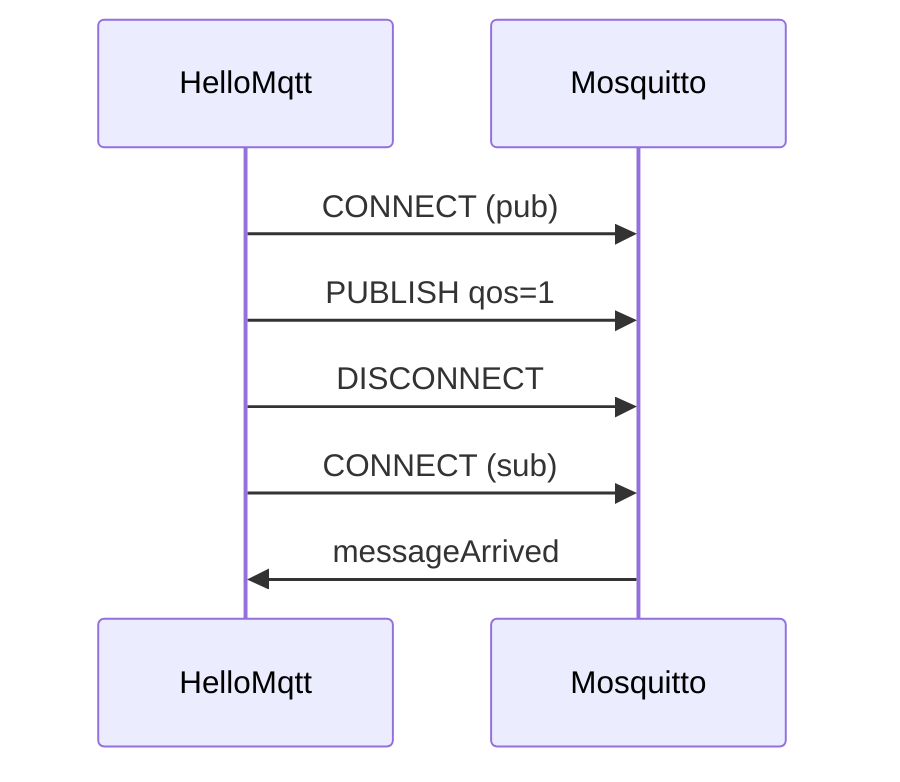

# B1 Eclipse Paho 与 MqttClient 基础

> 优先级: **P2 开发** | 预计阅读 35 分钟 | 深度：已深化

## 本章解决什么问题

在 Java 里把 MQTT 从「协议概念」落到 **可运行的客户端代码**：如何引入 Eclipse Paho、创建 `MqttClient`、配置 `MqttConnectOptions`、选择 **持久化（Persistence）** 实现，以及连接生命周期（connect / disconnect / close）的正确顺序。读完应能对照本仓 [HelloMqtt.java](../../examples/java/mqtt-basics/src/main/java/com/demo/mqtt/HelloMqtt.java) 独立完成一次发布 + 订阅验证。

---

## 面试常问

1. Java 里常用的 MQTT 客户端库是什么？和 Netty 自研有何取舍？
2. 一个 JVM 进程应该建几个 `MqttClient`？能否多线程共用一个实例？
3. `MemoryPersistence` 和文件持久化有什么区别？什么时候必须用后者？
4. `clientId` 重复连接会怎样？生产如何生成？
5. `cleanSession`、`automaticReconnect` 在 Paho 里如何体现？

---

## 核心知识

### Eclipse Paho 是什么

**Eclipse Paho** 是 Eclipse 基金会维护的 MQTT 客户端实现，本仓 Java 示例使用 **MQTT v3.1.1** 的同步 API：`org.eclipse.paho.client.mqttv3`。Broker 侧常用 Mosquitto / EMQX；**协议由 Broker 实现，业务由 Paho 调用**。

Maven 依赖（版本由父 POM 管理，见 [mqtt-basics/pom.xml](../../examples/java/mqtt-basics/pom.xml)）：

```xml
<dependency>
  <groupId>org.eclipse.paho</groupId>
  <artifactId>org.eclipse.paho.client.mqttv3</artifactId>
</dependency>
```

### MqttClient 三要素

创建客户端需要三个参数：

| 参数 | 含义 | 本仓示例 |
|------|------|----------|
| `serverURI` | Broker 地址 | `tcp://localhost:1883`，可由环境变量 `MQTT_BROKER` 覆盖 |
| `clientId` | 会话标识，Broker 内唯一 | `hello-pub-` + 时间戳，避免本地重复连接互踢 |
| `persistence` | QoS1/2 未确认消息的本地存储 | `MemoryPersistence` |

```java
String broker = System.getenv().getOrDefault("MQTT_BROKER", "tcp://localhost:1883");
MqttClient client = new MqttClient(broker, clientId, new MemoryPersistence());
```

### 连接选项 MqttConnectOptions

常用项与 HelloMqtt 一致：

```java
MqttConnectOptions opts = new MqttConnectOptions();
opts.setCleanSession(true);      // 断开后不保留订阅与未投递的 QoS1/2 状态（3.1.1 语义）
opts.setAutomaticReconnect(true); // 网络闪断后由客户端库重连
client.connect(opts);
```

- **cleanSession=true**：适合后端微服务、演示程序；设备若要「离线期间堆积下行」需 false + 稳定 clientId，见 [A6](../01-面试篇/A6-session-keepalive.md)。
- **keepAlive / connectionTimeout / userName / password**：生产在 [B8](B8-config-management.md) 外置；TLS 用 `ssl://` URI。

### Persistence（持久化）详解

Paho 在 **QoS1、QoS2** 下会把尚未收到 Broker 确认的发布，以及（取决于 cleanSession）会话状态写到 `MqttClientPersistence`：

| 实现 | 行为 | 适用 |
|------|------|------|
| `MemoryPersistence` | 仅存内存，进程退出即失 | 开发、纯 QoS0、无离线补发需求 |
| `MqttDefaultFilePersistence` | 落盘目录 | 进程重启后仍能重发未确认的 QoS1/2 |
| 自定义 Persistence | 可接 Redis/DB（少见） | 多实例共享同一 clientId 时极谨慎 |

**要点：** QoS0 发布不走持久化队列；若业务只用 QoS0，`MemoryPersistence` 足够。一旦上 QoS1 且可能 **kill -9 重启**，应评估文件持久化，否则「以为已发」的报文可能丢失在客户端缓冲区。

### 生命周期与线程模型

推荐顺序：

```
new MqttClient → connect → publish/subscribe → disconnect → close
```

- **disconnect**：发 DISCONNECT，优雅结束会话。
- **close**：释放网络与持久化资源；不再使用该实例。
- Paho v3 **一个 `MqttClient` 实例对应一条 TCP 连接**；多主题发布/订阅可在同一 client 上完成。高并发场景常见做法是 **单 client + 业务线程池处理回调**（见 [B3](B3-subscribe.md)），而不是为每条消息 new 一个 client。

### 与 HelloMqtt 对照阅读

[HelloMqtt.java](../../examples/java/mqtt-basics/src/main/java/com/demo/mqtt/HelloMqtt.java) 故意用 **两个** `MqttClient`（一个发布、一个订阅），演示最小闭环：

1. 发布端：QoS1、`dev/test/hello`。
2. 订阅端：`setCallback` + `subscribe(topic, 1)`，sleep 2 秒收消息。

生产里通常 **一个长连 client** 同时承担 pub/sub，并统一处理 `connectionLost`。



---

## 面试标准答案

### 题：为什么 Java 物联网项目常用 Paho？

> Paho 是 Eclipse 官方维护的 MQTT v3.1.1 客户端，API 稳定、文档和 Broker 互通性好，Maven 一条依赖即可接入。它提供同步 `MqttClient` 和异步 `MqttAsyncClient` 两套 API，适合大多数业务先跑通再优化。自研 Netty 编解码可以完全掌控协议细节，但开发和测试成本高，还要自己处理 QoS 状态机、重连、持久化，一般只有中间件团队或极端定制才值得。面试和项目里应能说清：我们用的是标准客户端 + 标准 Broker，问题边界在配置和业务幂等，而不是协议实现。

### 题：MemoryPersistence 和文件持久化怎么选？

> MemoryPersistence 把未确认的 QoS1/2 消息放在进程内存里，实现简单，适合开发环境和服务端只做 QoS0/1 且能接受进程崩溃丢未确认报文的场景。MqttDefaultFilePersistence 会把未确认发布写到指定目录，进程重启后 Paho 仍能继续完成握手，适合边缘网关或必须保证「发出即至少一次」的 QoS1 发布端。注意持久化只解决客户端侧未确认消息，不能替代 Broker 的持久化配置，也不能弥补 cleanSession=true 时订阅会话被清空的问题。选型时要同时看 QoS、cleanSession 和是否会重复启动同一 clientId。

---

## 生产环境注意点

- **clientId 策略**：后端服务可用 `serviceName-{instanceId}`；设备用出厂 ID，禁止随机 UUID 导致会话无法恢复。
- **单进程单连接为主**：避免每个 HTTP 请求 new 一个 `MqttClient`，连接风暴会打满 Broker `max_connections`。
- **优雅停机**：在 Spring `SmartLifecycle` 或 shutdown hook 里 `disconnect` + `close`，防止幽灵会话。
- **TLS 与证书**：生产 `ssl://` + 校验主机名；开发可用 [B6](B6-local-dev.md) 的明文 1883。
- **监控**：记录 connect 耗时、`connectionLost` 次数、当前 inflight（`maxInflight` 见附录 G）。

---

## 易错点与反例（≥3）

1. **只 connect 不 close** — 反复集成测试会耗尽文件描述符；反例：循环 `new MqttClient` 从不 `close()`。
2. **clientId 固定为 `test`** — 第二个进程连接会把第一个踢下线；反例：多实例部署共用 `"order-service"`。
3. **QoS1 发布却用 MemoryPersistence + 经常 kill 进程** — 未确认消息可能丢；反例：以为「QoS1 就绝对进 Broker」而忽略客户端缓冲区。
4. **在未 connect 时 publish** — 抛 `MqttException`；应先 `connect` 或开启 `automaticReconnect` 并处理未连接队列（异步 API 更明显）。
5. **混淆 cleanSession 与 Persistence** — cleanSession 管 Broker 会话；Persistence 管客户端未确认发布，两者独立。

---

## 动手验证

1. 启动 Broker：`cd docker; docker compose -f docker-compose-mosquitto.yml up -d`（见 [B6](B6-local-dev.md)）。
2. 编译运行 HelloMqtt：

```bash
cd examples/java/mqtt-basics
mvn -q compile exec:java -Dexec.mainClass=com.demo.mqtt.HelloMqtt
```

3. 期望输出含 `Published to dev/test/hello` 与 `Received: hello mqtt`。
4. 换 Broker 地址：`$env:MQTT_BROKER="tcp://192.168.1.10:1883"` 后重跑。
5. 用 CLI 旁路验证：`mosquitto_sub -h localhost -t 'dev/test/#' -v`（附录 [F](../附录/F-mosquitto-cli-cheatsheet.md)）。

---

## 相关章节

- [B2 发布](B2-publish.md) · [B3 订阅](B3-subscribe.md) · [B6 本地 Mosquitto](B6-local-dev.md) · [B8 配置管理](B8-config-management.md)
- 协议基础：[A4 CONNECT 流程](../01-面试篇/A4-packets-connect-flow.md) · [A5 QoS](../01-面试篇/A5-qos-semantics.md)
- 附录：[C Paho 速查](../附录/C-paho-cheatsheet.md)
