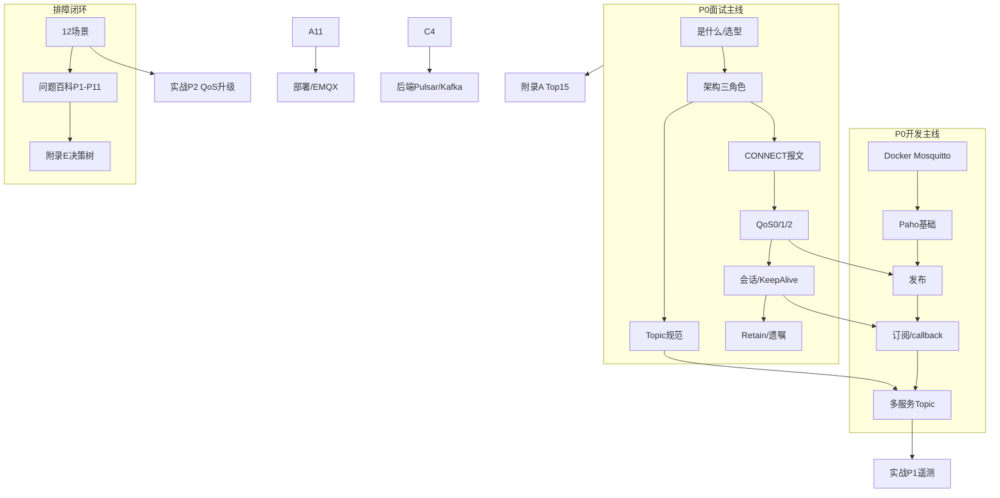

# MQTT 学习路径与面试串联（目标导向）

> **你怎么用本文：** 每天只打开对应「今日」一行 → 读完链接章节 → 做完「今日必做」→ 勾 [STUDY-TRACKER](STUDY-TRACKER.md) → 睡前看「明日预告」。  
> **面试怎么用：** 背熟 [§四 面试开场](#四面试开场30-秒--2-分钟--5-分钟) + [§五 知识串联](#五知识串联变成自己的话) + [附录 A Top15](附录/A-interview-questions.md)。

---

## 一、优先级（先学什么、什么可延后）

| 级别 | 含义 | 章节范围 | 目标 |
|------|------|----------|------|
| **P0 必会** | 面试开场 + 开发上岗最低线 | A1 A2 A3 A5 A6、B1 B2 B3 B4 B6、附录 A Top15、附录 B | 能讲清协议、能写 pub/sub、能排「收不到」 |
| **P1 强推** | 面试追问 + 日常排障 | A4 A7、B9、Part D P1~P4、附录 E F | CONNECT/QoS 细节、12 场景、现象百科 |
| **P2 进阶** | 中级岗位 / 上线前 | A8 A11 A12、B10 B12、C1 C4 C11、P1 项目 | TLS、选型、调优、桥接 |
| **P3 有余力** | 架构 / 运维岗 | A9 A10、B5 B7 B8 B11 B13、C 全章、P2~P4 项目 | 5.0、EMQX、改造推动 |

**IoT 平台 Java 岗：** 本仓覆盖 JD 里 **MQTT/接入** 一条线（约 25%）；Spring/Kafka/物模型需另补。本路径只保证 **MQTT 这条线闭环**。

---

## 二、知识串联总图（先建立地图）

**一句话串联（建议背成自己的）：**  
设备用 **长连接** 连 **Broker**，按 **Topic** 发布/订阅；可靠性靠 **QoS + 会话**；平台侧 **Java Paho** 接入，规范 **Topic**，关键链路 **QoS1 + 幂等**；出问题先 **CLI 划界** 再查 **会话/ACL/QoS**；规模大了 **EMQX 集群 + 桥接到 Pulsar**。

---

## 三、28 天逐日路径（今天 → 明天）

> 按每天约 1~1.5 小时。若全职复习，可压缩为 **14 天**（每天合并两行）。

### 第 1 周：面试主线（协议能讲）

| 天 | 今日学 | 今日必做 | 过关标志 | 明日预习 |
|----|--------|----------|----------|----------|
| **D1** | [A1](01-面试篇/A1-what-is-mqtt.md) [A2](01-面试篇/A2-architecture.md) | 画 Pub/Sub 图；口述 [30 秒开场](#四面试开场30-秒--2-分钟--5-分钟) | 能对比 HTTP 说 3 点 | A3 通配符 |
| **D2** | [A3](01-面试篇/A3-topics-wildcards.md) [A4](01-面试篇/A4-packets-connect-flow.md) | 默写 `+` `#` 规则；画 CONNECT 流程 | 发布不能用通配符 | A5 QoS |
| **D3** | [A5](01-面试篇/A5-qos-semantics.md) | 跑 [QoSDemo](../examples/java/mqtt-basics/src/main/java/com/demo/mqtt/QoSDemo.java)；默画 QoS 表 | QoS1 为何要幂等 | A6 会话 |
| **D4** | [A6](01-面试篇/A6-session-keepalive.md) [A7](01-面试篇/A7-retain-will.md) | `mosquitto_pub -r` 实验 retain；说清 Clean Session | 离线消息条件说全 | 附录 B |
| **D5** | [A8](01-面试篇/A8-security.md) [A11](01-面试篇/A11-broker-implementations.md) | 读 TLS 要点；Mosquitto vs EMQX 一句 | 能说 8883/mTLS | A12 或复习 |
| **D6** | [A12](01-面试篇/A12-performance-scale.md) [附录 B](附录/B-protocol-comparison.md) | 粗算 10W 带宽公式 | 选型表能讲 | 附录 A |
| **D7** | [附录 A](附录/A-interview-questions.md) 题 1~8 | **录音**自述 2 分钟版开场 + 随机 4 题 | 8 题对 6 | A 毕业考 |

### 第 2 周：开发上手（能写能联调）

| 天 | 今日学 | 今日必做 | 过关标志 | 明日预习 |
|----|--------|----------|----------|----------|
| **D8** | 附录 A 题 9~15 + A 毕业考 | 默画 QoS+CONNECT；错题回链 Part A | A 毕业考通过 | B6 环境 |
| **D9** | [B6](02-开发篇/B6-local-dev.md) [B1](02-开发篇/B1-paho-basics.md) | `docker compose up`；跑 [HelloMqtt](../examples/java/mqtt-basics/src/main/java/com/demo/mqtt/HelloMqtt.java) | Broker+Java 通 | B2 B3 |
| **D10** | [B2](02-开发篇/B2-publish.md) [B3](02-开发篇/B3-subscribe.md) | 跑 SubscribeDemo；自写 publish QoS1 | 独立 pub/sub | B4 |
| **D11** | [B4](02-开发篇/B4-multi-service-conventions.md) [附录 F](附录/F-mosquitto-cli-cheatsheet.md) | 设计 `{tenant}/{product}/{deviceId}/telemetry` | topic 能画 ACL | B9 或 P1 |
| **D12** | [实战 P1](实战项目/P1-device-telemetry.md)（阶段 1~2） | 按 P1 完成 pub/sub + CLI 验证 | P1 阶段 2 勾 | P1 阶段 3 |
| **D13** | P1 阶段 3 + [B5](02-开发篇/B5-high-volume-notes.md)  skim | 完成 P1 验收 | 端到端遥测通 | B9 |
| **D14** | B1~B8 复习 | `mvn -q compile`；过 B 毕业考清单 | B 毕业考 | 第 3 周 |

### 第 3 周：排障与调优（像做过项目）

| 天 | 今日学 | 今日必做 | 过关标志 | 明日预习 |
|----|--------|----------|----------|----------|
| **D15** | [B9](02-开发篇/B9-troubleshooting.md) 场景 1~4 | WrongTopicDemo + BlockingCallbackDemo | 会划界五步 | 场景 5~8 |
| **D16** | B9 场景 5~8 + [P1](04-问题百科/P1-message-loss.md) [P2](04-问题百科/P2-duplicate.md) | DuplicateHandlingDemo + RetainDemo | 每场景说现象 | P3 P4 |
| **D17** | B9 场景 9~12 + P3 P4 | OfflineSessionDemo；读 P6 P9 | 生产 vs 本地 | B10 |
| **D18** | [B10](02-开发篇/B10-performance-tuning.md) [附录 D](附录/D-performance-params.md) | 画调优金字塔；说 L0 三条 | 10W 粗算 | B12 |
| **D19** | [B12](02-开发篇/B12-environment-models.md) [C4](03-运维篇/C4-bridge.md) | 画 设备→EMQX→Pulsar | 桥接一句 | P2 项目 |
| **D20** | [实战 P2](实战项目/P2-qos-upgrade.md) | 断网实验 + QoS1 幂等 | P2 验收 1 项 | B13 |
| **D21** | 复习 B9 + [附录 E](附录/E-troubleshooting-decision-tree.md) | 模拟面试：讲一个排障故事 | 2 分钟排障叙事 | 第 4 周 |

### 第 4 周：面试固化 + 运维视野（选修加深）

| 天 | 今日学 | 今日必做 | 过关标志 |
|----|--------|----------|----------|
| **D22** | [A10](01-面试篇/A10-mqtt5-advanced.md) [A9](01-面试篇/A9-payload-format.md) | 口述 5.0 三点差异 | 不夸大 5.0 |
| **D23** | [C1](03-运维篇/C1-deployment.md) [C11](03-运维篇/C11-loadtest-connections.md) | ConnectionLoadTest 100 连接 | 知单机边界 |
| **D24** | [实战 P4](实战项目/P4-migrate-qos-topic.md) skim + [B13](02-开发篇/B13-advocacy-change-strategy.md) | 填 [附录 K](附录/K-one-page-proposal-template.md) 草案 | 能讲改造分期 |
| **D25** | 全真模拟面试 45min | 开场+QoS+排障+架构四段 | 弱项回炉 |
| **D26** | 弱项章节二刷 | 只读「未过关」 | — |
| **D27** | [C10](03-运维篇/C10-failure-runbook.md) skim | 读 2 条 Runbook | 运维加分 |
| **D28** | 总复习 | 过 TRACKER 全部勾选 | **MQTT 线毕业** |

---

## 四、面试开场（30 秒 / 2 分钟 / 5 分钟）

### 30 秒（自我介绍里嵌 MQTT）

> 我熟悉 **MQTT 3.1.1** 设备接入：发布订阅、长连接、Topic 路由。做过 **Java Paho** 收发，关键链路用 **QoS1 加业务幂等**。本地用 **Mosquitto** 联调，了解 **EMQX 集群** 和 **桥接到 Kafka/Pulsar** 的常见架构。排障上会从 **Topic、QoS、Clean Session、ACL** 几层划界。

### 2 分钟（「介绍一个 MQTT 项目」模板）

按 **背景 → 架构 → 我做的 → 难点** 四段（把 `{}` 换成你的）：

1. **背景：** `{行业}` 设备约 `{N}` 台，需要 `{遥测/指令}` 实时上云。  
2. **架构：** 设备 **MQTT** 连 `{Mosquitto/EMQX}`，Topic 规范 `{tenant/product/deviceId/stream}`，后端 `{规则/桥接}` 进 `{Pulsar/Kafka}` 做存储和消费。  
3. **我做的：** Paho 实现 pub/sub；关键指令 **QoS1**；消费端 **幂等**；配置 **ClientId、KeepAlive、Clean Session**。  
4. **难点：** 讲过 **{收不到/重复/断连}` 中真实一个**，用 `{CLI 或日志}` 定位到 `{根因}`，改为 `{措施}`。

### 5 分钟（架构深挖）

在 2 分钟基础上加：

- **QoS 选型表** + 为什么没全网 QoS2  
- **会话：** 哪些设备 `Clean Session=false`  
- **安全：** TLS、ACL 前缀  
- **规模：** 连接数、上报频率、粗算带宽；为何单机 Mosquitto 不够  
- **与 MQ 分工：** MQTT 负责接入，Pulsar 负责流处理（不混淆）

---

## 五、知识串联：变成自己的话

| 步骤 | 做什么 | 产出 |
|------|--------|------|
| 1. 画一张总图 | 照 [§二](#二知识串联总图先建立地图) 自己重画 | A4 纸一张 |
| 2. 每天 1 个「一句话」 | 学完当日章节，用 **自己的例子**（如温湿度上报）复述 | TRACKER 每日日志 |
| 3. 实验绑记忆 | 每个 P0 章至少 1 次 CLI 或 Java（见逐日「今日必做」） | 肌肉记忆 |
| 4. 排障故事库 | B9 每场景写 **3 行**：现象→根因→修复 | 面试素材 |
| 5. 模拟追问链 | QoS → 幂等 → 会话 → Topic → 桥接（附录 A 顺序） | 不被带偏 |
| 6. 项目锚定 | P1/P2 做完后，**2 分钟项目**只讲 P1/P2 真实操作 | 可信 |

**禁止：** 只背附录 A 不看 A 章；只跑 Demo 说不出 Clean Session；面试把 MQTT 说成「绝对不丢」。

---

## 六、章节 ↔ 路径 ↔ 面试权重

| 章节 | 路径天 | 面试权重 | 开发权重 |
|------|--------|----------|----------|
| A1 | D1 | ★★★ 开场 | ★ |
| A2 | D1 | ★★★ 开场 | ★★ |
| A3 | D2 | ★★★ | ★★★ |
| A4 | D2 | ★★★ | ★★ |
| A5 | D3 | ★★★★★ | ★★★★★ |
| A6 | D4 | ★★★★★ | ★★★★ |
| A7 | D4 | ★★★ | ★★ |
| A8 | D5 | ★★★ | ★★★ |
| A9~A10 | D22 | ★★ 加分 | ★ |
| A11~A12 | D5~D6 | ★★★ | ★★ |
| B1~B4 | D9~D11 | ★★ | ★★★★★ |
| B6 | D9 | ★ | ★★★★★ |
| B9 | D15~D17 | ★★★★ | ★★★★★ |
| B10~B13 | D18~D24 | ★★ | ★★★★ |
| Part D | D16~D17 | ★★★ 追问 | ★★★★★ |
| Part C | D23+ | ★★ 架构岗 | ★★★ 运维 |
| P1~P2 | D12~D13 D20 | ★★★★ 项目 | ★★★★★ |

---

## 七、今日起步（你若还没开始）

**今天（D1）：** [A1](01-面试篇/A1-what-is-mqtt.md) → [A2](01-面试篇/A2-architecture.md) → 画架构图 → 背 30 秒开场。  
**明天（D2）：** [A3](01-面试篇/A3-topics-wildcards.md) + [A4](01-面试篇/A4-packets-connect-flow.md)。

勾选进度：[STUDY-TRACKER](STUDY-TRACKER.md)
