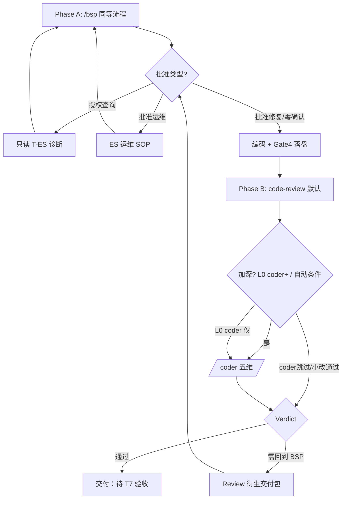

# BUC Orchestrator（BSP + Code Review 闭环）

> 配合 `~/.cursor/commands/buc.md`。  
> **BUC** = **B**SP fix + **U**ser approve + **C**ode review loop。

**开场声明：** `[BUC] 已 Read buc-orchestrator，Phase A（BSP）起执行。`

---

## 总览



| Phase | 做什么 | 用户动作 |
|-------|--------|----------|
| **A** | 完整 BSP（读 `bsp-orchestrator`） | `批准修复` / `批准运维` / `授权查询` / 零确认 |
| **B** | 只读 Review：`code-review`（默认）+ 按需 **`coder`** | 无（L0 可 `coder`/`coder+`/`coder跳过`） |
| **C** | Review 不通过 → 新 BSP 交付包 | 再次 `批准修复` |

**ES「有数据、接口空」**：Phase A 定位阶段 **强制** Gate 2 附录 T-ES1～7；未完成不得出根因（详见 `bsp-orchestrator`）。

**循环上限：** 同一 BUG **代码修复** 最多 **3 轮** A→B→C；第 4 轮须用户显式写 **`继续 BUC 循环`**。文档-only 轮次另计（见 Phase C）。

**v2 轮次控制：** 同一 **commit 范围**（或同一 Review 衍生 #n 修复批）内 **禁止** 用户再手动 `/code-review`；Phase B 即唯一全量 Review。衍生轮 Phase B **仅核对** Phase C 表格中的行 + D1–D8，**不得**新增未列入表格的 P1。

---

## Phase A — BSP（与 `/bsp` 相同）

1. Read **`~/.cursor/skills/bsp-orchestrator/SKILL.md`** 全文
2. 执行 Gate 0～6、G0-9（影响面 / 怎么验证 / 验证结果占位 / 后续演进）
3. BUG 默认 **直通修复**：首轮 **交付包（待批准）+ 停**（零确认 L0 除外）

**Phase A 首轮硬规则（D001 — 违反即流程 P0）：**

| 规则 | 说明 |
|------|------|
| **禁止同轮编码** | 未批准时 **不得** Write 业务文件、**不得**输出 `git diff`、**不得**写 hotfix §已修复 |
| **标题** | 仅允许 **`交付包（待批准）`**；**禁止** `（已执行）` / `（已完成）` |
| **L0 具体改法** | `/buc 把 commit 里 A 恢复成 B` = 描述 **改什么**，**≠** `批准修复` |
| **结束语** | 首轮必含：`回复 **批准修复** 后同会话编码` |
| **Phase B 顺序** | **禁止**未编码就进入 Phase B（无 diff 的 Review 仅 `/coder` 方案级除外） |

**误判案例（禁止复现）**：用户 `/buc` + 指定 commit/字段改法、**未说** `批准修复` → Agent 仍输出「已执行」并改代码 → **整段 revert**，只保留交付包文字。

4. 收到 **`批准修复`**（**须单独一条消息**，或 L0 同条 **零确认**）后：**同会话**编码 + Gate 4.4 对账（**D1–D8**）+ `bugfix-readme/hotfix_{BugId}-readme.md` + 专项 md + 台账
5. **Gate 5.1**：编码完成摘要须附 **IDEA 编译清单**；**Agent 禁止任何 `mvn`**（见 `bsp-orchestrator` Gate 5.1；KhLinks 见业务仓 `.cursor/rules/idea-local-run.mdc`）

**编码完成回复头：** `[BUC] Phase A 完成，进入 Phase B Code Review。`

**禁止：** Phase A 未完成编码就进入 Phase B。

---

## Phase B — Code Review（编码后 **自动**，无需用户再输入）

### B1 标准 Review（默认）

1. Read **`~/.cursor/skills/code-review/SKILL.md`**
2. 审查范围（按优先级）：
   - 本会话刚改文件列表
   - `git diff`（uncommitted + branch vs merge-base）
   - 对照 Phase A **交付包**中的「改什么 / 影响面 / 高并发表」
3. **只读**：不 Write/StrReplace 业务文件（除非 L0 含 `直接修 review 问题`）

**L0 `coder` 且非 `coder+`**：跳过 B1，直接进入 **B2 `/coder`**。

**L0 `coder跳过`**：仅 B1，不进入 B2。

### B2 深度 Review（`/coder`，按需）

**触发 B2**（满足 **任一**）：

| 来源 | 条件 |
|------|------|
| L0 | `coder`（仅 B2）/ `coder+`（B1 通过后必做 B2） |
| 自动 | B1 通过后：>3 文件、跨 2+ Maven 模块、热路径、新增 DB/Redis 写或定时 |
| 手动 | 用户单独 `/coder`（不在 BUC 链内） |

1. Read **`~/.cursor/skills/coder/SKILL.md`**
2. 输出 **R1～R5 五表** + Verdict
3. **只读**；Verdict **`需修改后再审`** → Phase C（同 code-review P0/P1）

**Phase B 回复头：**

- 仅 B1：`[BUC] Phase B Code Review 完成。Verdict: …`
- 含 B2：`[BUC] Phase B 完成（code-review + CODER）。Verdict: …` 或 `[BUC] Phase B CODER 完成。Verdict: …`

### Review 必查维度（BUG 修复专用）

**先过「编码硬门禁 6 条」**（`bsp-orchestrator` 顶部）；再查下表：

| 维度 | 查什么 |
|------|--------|
| **硬门禁 #4 范围** | diff 是否超出交付包「只改」？多出 → **P0** |
| **硬门禁 #3 删写** | 有删/改态却无「删写对照表」？表内「不应删谁」是否覆盖原业务？→ **P0/P1** |
| **硬门禁 #6 未覆盖** | 是否诚实列出本地验不到的场景？空白或「已全部覆盖」而实际只测 happy path → **P1** |
| **正确性** | 根因是否真修？是否只修展示未修写路径（或反之）？ |
| **回归** | 33955 类误回退是否可能再现？未删除设备状态是否误变？ |
| **并发** | 是否新增热路径 DB 写、多实例叠加、缺 cap/幂等？ |
| **安全** | SQL 注入、权限、日志泄密 |
| **测试** | **默认不应新增** `*Test.java`；未经 L0 要求的新增 test → P2 删除；仅标注存量缺口，不强制加 |
| **文档一致性** | hotfix **全文**；grep 旧配置名/类名；readme 四段同口径；`application.yml` diff 与 readme 配置表；**生产默认 vs 压测 profile** 是否分写 |
| **行为 parity** | 换路径/OpenApi：对照交付包 parity 表（异常类型、响应字段、统计注解） |
| **文档** | hotfix readme / §验证 / G0-9 是否齐 |

### Verdict 规则

| 级别 | 含义 | BUC 动作 |
|------|------|----------|
| **P0** | 必现错、数据错、安全 | **需回到 BSP** |
| **P1** | 高概率回归、并发风暴；**hotfix 与代码/yaml 事实矛盾**；**同一 readme 内前后矛盾** | **需回到 BSP** |
| **P2** | 风格、可维护性；专项 md 过期但 hotfix 已正确 | 记入建议，**通过**（须同轮修专项 md） |
| **P3** | nit | 记入建议，**通过** |

---

## Phase C — 回到 BSP（仅 Verdict = 需回到 BSP）

1. 在专项 md / hotfix readme 追加 **「Review 衍生 #n」**（不覆盖原根因）
2. 输出 **Review 衍生 #n 交付包**（**一批修完**，见 `bsp-orchestrator` Gate 7 模板）：Review 发现 → **表格列全项** → 验收
3. **停**，等用户 **一次** **`批准修复`**（**禁止**拆成「先修 P1-1、再 Review、再修 P1-2」）
4. 批准后 → Phase A 编码（**最小 diff**；代码项与 **文档-only 项同批**）→ 自动 Phase B（**衍生轮**：仅核对表格 + D1–D8）

**文档-only 修复轮**：仅改 hotfix / 专项 md 时仍须 Gate 4.4 对账 + Phase B；**不计入**「同一 BUG 代码修复 3 轮」上限（见下）。

**禁止：** Review 发现 P0/P1 后未经批准直接改代码；**禁止** Phase C 只修表格中部分行就称 #n 完成。

**循环上限：** 同一 BUG **代码修复** A→B→C 最多 **3 轮**；第 4 轮须用户显式写 **`继续 BUC 循环`**。**文档-only 轮次另计**。

---

## Phase D — 闭环完成

当 Verdict = **通过** 或 **通过（含 P2/P3 建议）**，且 **文档落盘表全部「已对齐」**（Gate 4.4 / G0-3）：

```markdown
[BUC] **BUG-xxxx 修复+Review 完成（待你验收）**

| 项 | 内容 |
|----|------|
| Phase A | 改动摘要 |
| Phase B | Review Verdict + **CODER R1～R5 摘要（若跑 B2）** + P2/P3 建议（如有） |
| 影响面 | 见 hotfix readme |
| 怎么验证 | T7 + SQL |
| **IDEA 编译（你来）** | …（Gate 5.1 清单，Agent 不跑 mvn） |
| 验证结果 | **待填写** → 回复 `T7 通过` |

Review 轮次：n/3
```

---

## 与 `/bsp` / `/code-review` 关系

| 命令 | 用途 |
|------|------|
| `/bsp` | 仅 Phase A，编码后 **不** 自动 Review | 纯分析、方案 |
| `/code-review` | 仅标准 Phase B，可单独对任意 diff | 任意 diff（**同一 commit 范围最多 1 次**；BUC 已通过则不必再调） |
| **`/coder`** | **仅深度五维**（R1～R5） | 合入前加严、热路径、或 `/bsp` 仅影响评估 |
| `/buc` | Phase A → B（B1 按需 B2）→（C 循环）→ D | **合 Gerrit 的 BUG 修复（默认）** |

单独 `/code-review` 或 **`/coder`** **不**触发 BSP 回流；仅 BUC 链内 P0/P1 触发 Phase C。  
**已用 `/bsp` 编码的 Bug**：续修须 **`/buc`** 或 L0 **`Review 衍生 #n 批准修复`**，勿重置为全新 `/bsp` 首轮。

---

## 优先级

`用户指令 > buc-orchestrator > bsp-orchestrator > code-review skill > 默认`

用户中文 → 全程简体中文。
