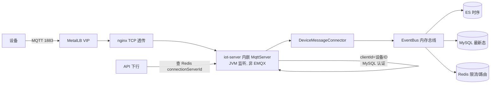
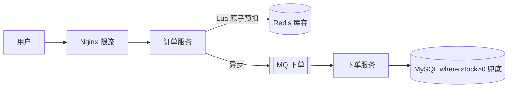

# 23 · 系统设计 / 场景题（IoT 平台岗 · 定制版）

> 资深 Java 后端 · IoT 平台岗。场景题**按简历分三档**：**IoT 主战场（必深挖 L4）→ ERP 交易副战场（必问）→ 通用场景（一笔带过）**。
> 面试官考场景题不是要标准答案，是要看四件事：**需求澄清 → 容量估算 → 整体架构 → 核心难点取舍**，以及你有没有真踩过坑、报得出数字。
> 配套深挖：[场景题模板（GIIC 15W 六算全表）](../../../05-Interview-Prep/场景题-容量预估L4-GIIC15W标准用例.md) · [深追 L4 套题 50 题](../../../05-Interview-Prep/深追L4-套题-GIIC-OOM-MySQL-队列-JVM.md) · [GIIC 复盘](../../../02-EMQX-IoT-Tuning/GIIC-15万压测参与复盘.md)

---

## 一、通用方法论（先背下来）🔥

任何系统设计题，按这个框架展开就不会乱：

1. **需求澄清**：功能性需求（要做什么）+ 非功能性需求（QPS、数据量、延迟、一致性、读写比）。
2. **容量估算**：QPS（设备数 ÷ 上报周期）、存储（条数 × 单条大小 × 时间 × 副本）、带宽、内存。
3. **顶层设计**：接入层 → 应用层（无状态）→ 缓存层 → 存储层 → 异步层。
4. **核心链路细化**：把最难的点（高并发写、一致性、热点、背压）单独深挖。
5. **取舍说明**：CAP 怎么选、一致性 vs 性能、成本 vs 可用性。

> IoT 岗的差异：估的是**长连接数 + 属性上报 msg/s**，不是 DAU×请求数。入口是**设备**不是浏览器。

---

## 二、IoT 场景主战场 🔥🔥🔥（简历第一钩子，必深挖到 L4）

> 这是你 2025 年至今的主炮，面试官看到「IoT Meta 平台」第一句就会往这追。下面 6 个场景每个都要能口播。

### 2.1 设备接入全链路架构（90 秒口播题）🔥🔥🔥

**一句话**：设备 MQTT 1883 连进来 → iot-server 内嵌 MqttServer 解码 → EventBus 分发 → 分写 ES/MySQL/Redis；下行靠 Redis 路由 + 集群 RPC。



**三个关键设计点（追问必答）**：

| 点 | 答法 |
|----|------|
| 为什么内嵌 MqttServer 不用 EMQX？ | iot-server 内嵌 MQTT，JVM 线程在 Pod 监听 1883；nginx 只做 TCP 透传。**别说独立 EMQX** |
| 上报走 Pulsar 吗？ | **不走**。解码 → **EventBus**（内存总线）→ ES/MySQL/Redis；Pulsar 只用于级联 |
| 多副本怎么下行？ | 会话驻留 Pod 内存 localSessions；API 打到无会话 Pod → 查 Redis `connectionServerId` → 集群 RPC 转到持会话 Pod → MQTT 下发 |

**追问陷阱**：「Pod 重启会怎样？」→ TCP 断、设备重连；localSessions 是内存态，路由靠 Redis。

### 2.2 容量预估 · GIIC 15W 长连接（面试官最爱问「几台机器/多大内存/多大带宽」）🔥🔥🔥

**一句话**：15 万 CoAP-TCP 连接 = 5 台压测机 × 3 万线程；服务端 4 × (32C,128G)，JVM 32G/实例；验收 5000 msg/s + 96h。

**六算全表（口播只报数量级 + 一条算式）**：

| 算 | 结果 | 态别 |
|----|------|------|
| ① QPS | 5000 msg/s（属性），反推 150000÷30s=5000 | `[文档]`+`[反推]` |
| ② 带宽 | 历史保守假设：5000×3属性×1KB×8 ≈ 120Mbps（+心跳/ACK ≈152Mbps） | `[假设]`；未完成抓包实测 |
| ③ 存储 | ES 5000×3=15000 docs/s；历史按 0.5KB/doc 粗算 ~620GB/天 | `[假设]`；未完成 ES 增量实测 |
| ④ 缓存/堆 | 连接 ~440MB/实例（~11.8KB×37500）；堆 32G（稳态 8~10G + 密钥 5.6G） | `[文档]` |
| ⑤ 连接/池 | 37500/实例（占 50k 上限 75%）；MySQL 1200 连接、应用池 4×64 | `[文档]` |
| ⑥ 机器 | 4×(32C,128G,SSD,万兆) + 148 Nginx | `[文档]` |

**完整 90 秒口播**：

> 15W GIIC 先澄清：**CoAP-TCP、15 万连接、5000 msg/s 验收**，反推 30 秒一台。历史规划曾按 **1KB×3** 粗算 120Mbps、加心跳 ACK 约 152Mbps，并按 0.5KB/doc 粗算约 620GB/天；这些都是保守 `[假设]`。本文另有 450B 文档值，但缺原始抓包/脚本输出，只能标 `[文档/待补实测]`。主答应明确抓包、网卡增量和 ES 增量实测尚未完成。连接内存与 32G 仍按规划档位讲。边界：我负责**网关协议段**，device-manager 政策禁改。

**追问链（L4 核心，每个都要能接住）**：

| 追问 | 标准接法 |
|------|----------|
| 「5000 怎么来的？」 | 验收指标；150000÷30s=5000 |
| 「心跳算吗？」 | 不算，5000 是属性 Data；心跳单独 ~2500/s |
| 「1KB/450B 哪量的？」 | 1KB×3 是历史保守假设；450B 只有文档记录，原始抓包/脚本输出缺失，均不是唯一实测值 |
| 「为什么 5k 就挂还申请 32G？」 | 5k 挂是 **Sink/Redis 架构**，不是堆不够；32G 按 15W + Login 尖刺规划 |
| 「20W 怎么扩？」 | 没做过 20W；若题目假设 200k/60s/50k每节点，可迁移六算，+1 节点只是待基线验证的候选方案 |

> 全量六算、三层字节、公式卡、场景矩阵见「场景题模板」。**每天练的就是这张口播卡**。

### 2.3 故障排查 · ES 写慢（NFS IO 链）🔥🔥

**现象**：10W 压测，主机 CPU/内存没打满，但 ES write 线程排队，单 Pod 消息堆几十 G。

**排查链（分层定位）**：

```text
现象：write 线程满 + CPU 不高 = 等 IO（不是算力不够）
分层：ES write pool → data 路径 → 发现 ES 数据盘挂在 NFS 上
根因：bulk 超时 → iot 侧 elasticsearch-buffer 积压（每 Pod ~30G，合计 ~155GB）
     → 失败进 dead 队列 → 属性历史落后实时态 2~3h
止血：热索引 replicas=0、refresh 调优
长期：data 盘换本地 SSD；应用侧改「只重试失败项」，别 hasFailures 整批 requeue
```

**追问**：「CPU 不高怎么还慢？」→ 写线程在**等 NFS IO 返回**，经典「资源不高但慢」陷阱。「公式算 620GB/天能写，为什么堵？」→ 公式算的是吞吐，NFS 卡的是 **IO 延迟**，不是吞吐量。

### 2.4 故障排查 · OOM（operatorCache 无界缓存）🔥🔥

**现象**：8G 堆卡死，接口超时、消息停滞，6G 和 8G 一样卡。

```text
现象：jstat Old 96%+、FGC≈YGC（Full GC 风暴）
定位：jcmd dump → MAT → OQL 数出 5050 个 ExtendDeviceOperator
根因：operatorCache 无界（无 maximumSize、无 TTL、注销不 invalidate）
     → 每台物模型 3.4~15.6MB 永驻 → 5050 台 Dominator 5.66GiB（占堆 78%）
方案：Caffeine maximumSize + expireAfterAccess + 设备注销 invalidate
状态：补丁待 Gerrit 正式流程合入，暂无复测收益
```

**追问（L4 关键）**：「设备数才 5050，怎么堆就爆了？」→ **有限 key × 胖 value × 不淘汰**。「加内存行吗？」→ 6G→8G 只多撑 2~3 天，缓存不设上限迟早再满。「怎么找到 Dominator 的？」→ heap dump → MAT Dominator Tree，retained 一眼见。

> 这套「jstat → dump → MAT → 根因 → 修复」就是你的**稳定性排查 SOP**，面试讲一次这个 case 顶十句「我会 jvm 调优」。

### 2.5 级联设计 · Pulsar（历史材料待核对）🔥

**一句话**：Pulsar 可用于**级联/跨平台**，不是设备第一跳；“20W级联”当前只有历史材料，缺少原始压测证据，不能当本人可主讲经历，也不等于20W MQTT官方/假设容量题。

**关键点**：
- **多消费者不能抢同一分区**：消费者数要和分区数对齐，否则有的分区空转、有的堆积。
- 租户/命名空间/分区需要按目标吞吐、key 分布和消费者并行度规划；20W、7天等历史数字待本人核对。
- 积压时**先看分区分配，再加消费者**（消费者数 > 分区数是无效的）。

**追问**：「级联和 EventBus 什么关系？」→ 设备第一跳走 EventBus 内存总线（低延迟），Pulsar 是跨平台异步通道（持久化+削峰），两条线别混。

### 2.6 物模型 / 规则引擎 / 超级设备（概念防御）⭐

- **物模型**：设备的标准化数据描述（属性/事件/服务三要素），是 IoT 的「设备契约」。
- **规则引擎**：基于物模型做「触发条件 → 动作」（告警、转发、联动）。
- **超级设备**：拓扑父节点（聚合多个子设备），走 OpenAPI 读写。

> 一句话即可，被深挖再展开。详见 JD 雷达 01/06。

---

## 三、ERP 交易副战场 🔥🔥（简历 ERP 必问，降级但别翻车）

> ERP 历史材料只确认 300+ 商户、日峰值约 3000 万和四类机制；具体接口/回调/消费端/状态流落点及“零超卖/零重复扣款”结果待本人核对。当前不主动深讲。

### 3.1 秒杀 / 库存不超卖（官方变体，不冒充 ERP 实现）🔥🔥

**核心矛盾**：瞬时高并发 + 有限库存 + 不能超卖。



**ERP 口径（30 秒）**：历史材料记录 300+ 商户、日峰值约 3000 万，并提到分布式锁、幂等、唯一约束、状态机四类机制；具体链路组合、表结构和结果待本人核对，当前不主动深讲。上图只代表秒杀官方变体。

**追问（L4）**：
- 「分布式锁有坑吗？」→ 锁过期、重入、删锁归属（value 校验）；唯一约束兜底。
- 「超卖怎么防？」→ 可按官方变体讨论 Redis Lua、DB 条件更新、幂等与补偿；不能说项目就是这样落地。
- 「Seata AT 和本地消息表怎么选？」→ 仅作通用选型题，不绑定 ERP 生产实践。

### 3.2 订单超时关闭（延迟任务）🔥

30 分钟未支付自动关单。生产推荐 **MQ 延迟消息 / 时间轮 + DB 兜底扫描**，关单时校验状态（幂等），防误关已支付订单。

---

## 四、通用场景一笔带过（速记表 · 不深挖）

> 你面 IoT 岗，这些纯互联网场景**问到的概率低**，扫一眼能说个方向即可，别花时间背。

| 场景 | 一句话方案 |
|------|-----------|
| 短链系统 | 发号器 + 62 进制；读走 Redis + 布隆过滤器防穿透 |
| IM 长连接 | WebSocket/Netty；uid→gateway 路由存 Redis；消息 ACK + seq 保序 |
| Feed 流 | 推拉结合：普通用户推（写扩散）、大 V 拉（读扩散） |
| 排行榜 | Redis ZSet；海量分片局部 TopK 归并 |
| 附近的人 | Redis GEO（geohash） |
| 分布式 ID | Snowflake / 号段 / Leaf |
| 点赞计数 | Redis incr + 异步落库 |

---

## 五、容量估算方法论 🔥🔥（架构师必问，单独精通）

> 面试官最爱追问「要几台机器/多少内存/多大带宽」。**没有估算的架构是空谈**。IoT 岗把「DAU」换成「设备数」即可。

### 1. 先记数量级

| 量 | 数量级 |
|----|--------|
| 1 天 | ≈ 86400 秒 ≈ 10^5 秒 |
| 单机 QPS（普通 Java 服务） | 几百 ~ 数千 |
| Redis 单实例 QPS | ~10 万 |
| MySQL 单机 QPS | 几千（读）/ 上千（写） |
| 内存随机读 ~100ns / SSD ~100μs / 磁盘随机 ~10ms / 同城网络 ~0.5ms | |

### 2. 通用公式（电商）vs IoT 公式

```text
【电商】平均 QPS = DAU × 人均请求 / 86400 × 峰值系数(2~10)
【IoT】上报 QPS = 设备数 / 上报周期(秒)          ← 你用的这条
【IoT】带宽(Mbps) = msg/s × 属性数 × 字节 × 8 / 10^6
【IoT】ES docs/s = msg/s × 每msg属性数
【IoT】存储 = docs/s × 86400 × avg_doc × 副本 × 1.3
【通用】所需机器 = 峰值 QPS / 单机 QPS × 冗余(1.5~2)
【通用】所需并发(线程) = QPS × RT（little's law）
```

**例（IoT）**：15 万设备、30s 上报 → 5000 msg/s；历史曾按 1KB×3 粗算 120Mbps、按 0.5KB/doc 粗算 620GB/天，均为 `[假设]`。450B 仅为 `[文档/待补实测]`，主答说明抓包和 ES 增量实测未完成。

> **答题套路**：报数字一定**说清假设**（"假设每 msg 3 属性、单 doc 0.5KB"），给出**数量级结论 + 由此的架构决策**（要不要换 SSD、几台机器），这是架构师思维而非背题。

---

## 高频追问清单（IoT 岗版）

- **设备接入走 Pulsar 吗？** → 不走；EventBus 第一跳，Pulsar 级联（2.1）。
- **15W 要几台机器/多大堆？** → 4×128G、JVM 32G、5000/s（2.2）。
- **为什么 5k 就挂？** → Sink/Redis 架构，不是堆不够（2.2）。
- **CPU 不高但 ES 慢？** → 写线程等 NFS IO，不是算力不够（2.3）。
- **OOM 怎么定位？** → jstat → dump → MAT → operatorCache 无界（2.4）。
- **级联积压怎么处理？** → 先查分区对应，再扩消费者（2.5）。
- **ERP 怎么防超卖？** → 分布式锁 + 幂等 + 唯一约束 + 状态机（3.1）。
- **容量怎么估？** → 设备数÷周期=QPS，再算带宽/存储/内存（五）。
